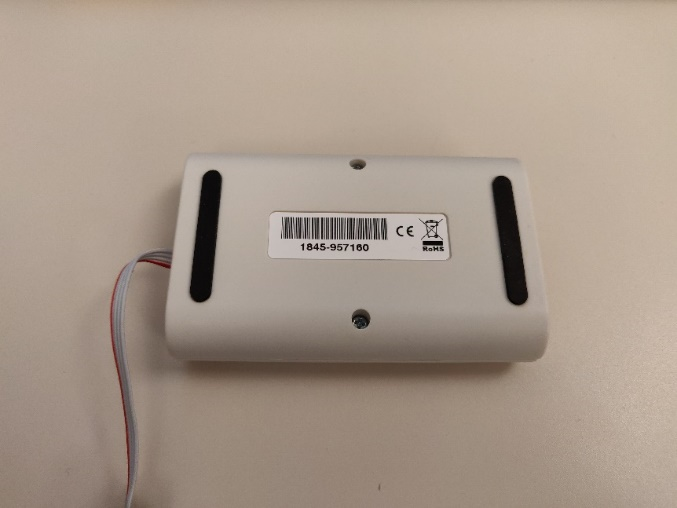
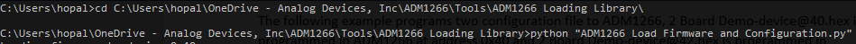
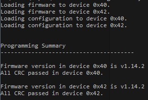
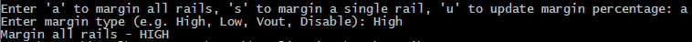
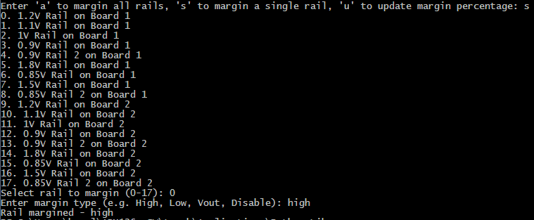
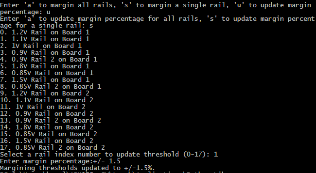
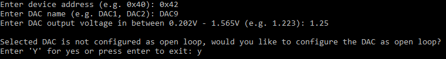

# ADM1266-PYTHON
ADM1266 user interfacing scripts to load firmware, access Blackbox, perform margining operations, and read back telemetry.

## Table of contents

1. [Description of the Modules](#description-of-the-modules)  
    a. [Library Module](#library-module)  
    b. [PMBus Module](#pmbus-module)  
    c. [User Interfacing Scripts](#user-interfacing-scripts)  
2. [User Specific Modifications](#user-specific-modifications)  
    a. [Modifications Applicable to PMBus_I2C](#modifications-applicable-to-pmbus_i2c)  
    b. [Modifications Applicable to All User Interfacing Scripts](#modifications-applicable-to-all-user-interfacing-scripts)  
    c. [Modifications Applicable to Firmware and Configuration Loading Script](#Modifications-Applicable-to-Firmware-and-Configuration-Loading-Script)  
5. [Description of User Interfacing Scripts](#Description-of-User-Interfacing-Scripts)  
    a. [ADM1266 Load Firmware and Configuration.py](ADM1266_Load_Firmware_and_Configuration.py)  
    b. [ADM1266 Telemetry Read.py](ADM1266_Telemetry_Read.py)  
    c. [ADM1266 Blackbox Read.py](ADM1266_Blackbox_Read.py)  
    d. [ADM1266 Margin - Closed Loop.py](ADM1266_Margin_-_Closed_Loop.py)  
    e. [ADM1266 Margin - Open Loop.py](ADM1266_Margin_-_Open_Loop.py)  

## Description of the Modules

### Library Module
[ADM1266_Lib.py](ADM1266_Lib.py) contains all the ADM1266 related functions which are called by the user interfacing scripts. It is not recommended to modify this library.

### PMBus Module
[PMBus_I2C.py](PMBus_I2C.py) contains call APIs which uses the Total Phase Aardvark dongle to communicate with the ADM1266.  
If a different i2c dongle is used, the user need to include the APIs for that specific dongle.

### User Interfacing Scripts
Scripts such as [ADM1266 Load Firmware and Configuration.py](ADM1266_Load_Firmware_and_Configuration.py), [ADM1266 Blackbox Read.py](ADM1266_Blackbox_Read.py), [ADM1266 Telemetry Read.py](ADM1266_Telemetry_Read.py), etc are user interfacing scripts which call required functions in the [ADM1266_Lib.py](ADM1266_Lib.py) to perform a specific task.
Minor modifications are required by the user to update the script with their system specific information. The required modifications are described in [Modifications Applicable to All User Interfacing Scripts](#modifications-applicable-to-all-user-interfacing-scripts) and [Modifications Applicable to Firmware and Configuration Loading Script](#Modifications-Applicable-to-Firmware-and-Configuration-Loading-Script).

## User Specific Modifications

### Modifications Applicable to PMBus_I2C
This section covers the modifications required in [PMBus_I2C.py](PMBus_I2C.py) to interface with a different I2C dongle or master. Common modifications in the section below is not applicable for this module.  

**`PMBus_Write_Read(device_address, write_data, read_length)`**
This function is provided with the ADM1266 device address, register address, and the number of bytes to be read. It returns array of data byte which is read back from the ADM1266. Within the function, `aardvark_py.aa_i2c_write_read` API needs to be updated with a similar API of the new I2C dongle or master.

**`PMBus_Write (device_address, write_data)`**
This function is provided with the ADM1266 device address and the data which needs to be written to the ADM1266. Within the function, `aardvark_py.aa_i2c_write` API needs to be updated with a similar API of the new I2c dongle or master.

**`Open_Aardvark(Number)`**
This function is Total Phase Aardvark specific. It can be removed if a different I2C master is used.

**`Open_Aardvark()`**
This function is Total Phase Aardvark specific. It can be removed if a different I2C master is used.

### Modifications Applicable to All User Interfacing Scripts
This section covers the modifications that are applicable for all the user interfacing scripts, listed below:  
[ADM1266 Load Firmware and Configuration.py](ADM1266_Load_Firmware_and_Configuration.py)  
[ADM1266 Telemetry Read.py](ADM1266_Telemetry_Read.py)  
[ADM1266 Blackbox Read.py](ADM1266_Blackbox_Read.py)  
[ADM1266 Margin - Closed Loop.py](ADM1266_Margin_-_Closed_Loop.py)  
[ADM1266 Margin - Open Loop.py](ADM1266_Margin_-_Open_Loop.py)  

#### Step 1:
Open the respective python script using any text editor. 

#### Step 2:
The unique ID, 1845957160, in the following line of the script requires to be updated with the unique ID of the dongle which is used to communicate with the ADM1266. 
`PMBus_I2C.Open_Aardvark(1845957160)`
The unique ID of the dongle is printed on the dongle, shown in Figure 1.
If no unique ID is provided, the first un-used Aardvark detected will be used.    

    
     
    <em>Figure 1. Unique ID on the Dongle</em>

  

#### Step 3:
The address of the ADM1266s which are in the same system requires to be updated in the following line of the script. The addresses need be separated by commas.
`ADM1266_Lib.ADM1266_Address = [0x40, 0x42]`
The example above shows ADM1266s with PMBus address of 0x40 and 0x42. 

### Modifications Applicable to Firmware and Configuration Loading Script
This section covers the specific modifications required only for [ADM1266 Load Firmware and Configuration.py](ADM1266_Load_Firmware_and_PMBus_Configuration.py).

#### Step 1:
The firmware file which will be used to program all the ADM1266 is defined in the following line of the script. The same firmware file will be used to program all the ADM1266 in a system. The following example points to the latest firmware hex file, which is included with the script.
`ADM1266_Lib.firmware_file_name = "adm1266_v1.14.2_b0.hex"`
If the firmware file is in the same directory as [ADM1266 Load Firmware and Configuration.py](ADM1266_Load_Firmware_and_PMBus_Configuration.py), it is only required to enter the name of the firmware HEX file, otherwise the full path is required.

#### Step 2:
The configuration file which will be used to program all the ADM1266 in a system is defined in the following line of the script. Each ADM1266 in a multi-device system will have its own unique configuration file. Each configuration file is separated by a comma. 
The following example is for programming two configuration files to two ADM1266, [2 Board Demo-device@40.hex](Firmware_Configuration_Files/2_Board_Demo-device@40.hex) is programmed in ADM1266 at address 0x40 and [2 Board Demo-device@42.hex](Firmware_Configuration_Files/2_Board_Demo-device@42.hex) is programmed in ADM1266 at address 0x42.
The configuration file names should be listed in the same order as PMBus addresses defined in Step 3 of Modifications Applicable to All Scripts.
`ADM1266_Lib.config_file_name = ["2 Board Demo-device@40.hex", "2 Board Demo-device@42.hex"]`
If the configuration files are in the same directory as [ADM1266 Load Firmware and Configuration.py](ADM1266_Load_Firmware_and_PMBus_Configuration.py), it is only required to enter the name of the configuration files, otherwise the full path is required. 

## Description of User Interfacing Scripts

### Firmware and Configuration Loading Script
Functions used from [ADM1266_Lib.py](ADM1266_Lib.py):

•	`ADM1266_Lib.program_configration(soft_reset)`
This function loads the configuration files defined in ADM1266_Lib.config_file_name
to all the devices listed in ADM1266_Lib.ADM1266_Address. Pass soft_reset as False to do a seamless reset after loading the configuration, do not pass any value if soft reset/sequence reset is needed after loading the configuration.

•	`ADM1266_Lib.program_configration()`
This function loads the firmware file defined in ADM1266_Lib.firmware_file_name
to all the devices listed in ADM1266_Lib.ADM1266_Address. 
No parameter needs to be passed to this function.

•	`ADM1266_Lib.crc_summary()`
This function triggers a CRC recalculate and reads back the CRC status of all the devices listed in ADM1266_Lib.ADM1266_Address.
No parameter requires to be passed to this function.

Navigate to the directory where [ADM1266 Load Firmware and Configuration.py](ADM1266_Load_Firmware_and_Configuration.py) is located. 
In the command prompt type `python “ADM1266 Load Firmware and Configuration.py”` to run the script, shown in Figure 2.  

    
     
    <em>Figure 2. Command to Run the Python Script</em>

  

When the script is running it will display the loading step it is currently running.
At the end of the programming, the script will display the firmware version and the CRC status, as shown in Figure 3.
If the CRC check passed, it means the firmware and the configuration were loaded successfully.  

    
     
    <em>Figure 3. Programming Summary</em>

  

### Closed Loop Margining Script
Functions used from [ADM1266_Lib.py](ADM1266_Lib.py):

•	`ADM1266_Lib.margin_all(margin_type, group_command)`
This function margins all the closed loop margin rails in devices listed in ADM1266_Lib.ADM1266_Address. 
margin_type is passed as a string valid parameter are High, Low, Vout, Disable
group_command is passed as a boolean. If set to True margin high will be sent as a group command to all the devices. If the parameter is left blank or False individual margining command will be set to each device

•	`ADM1266_Lib.margin_single(address, channel, margin_type)`
address is passed to the function as an integer.
channel is passed as a string which is the physical name of the input channel which needs to be margined, valid parameters are VH1-VH4, VP1-VP13.
margin_type is passed as a string valid parameter are High, Low, Vout, Disable

•	`ADM1266_Lib.margin_single_percent(address, pin_number, margin_percent)`
This function is used to update the closed loop margin thresholds by percentage. The function automatically reads back the nominal voltage and sets the margin high and low limit by required percentage. 
address is passed to the function as an integer
pin_number is the index of the input pin for which the margining thresholds need to be updated, valid inputs are 0 – 16
margin_percent is the percentage of the nominal to which the margin high and low thresholds should be set, valid inputs are any positive number

Navigate to the directory where [ADM1266 Load Firmware and Configuration.py](ADM1266_Load_Firmware_and_Configuration.py) is located. 
In the command prompt type `python “ADM1266 Margin - Closed Loop.py”` to run the script.
To margin all the rails to a certain margining status, input “a” and press enter. In the next prompt, enter one of the valid margining status: high, low vout and disable.   

    
     
    <em>Figure 4: All Channel Closed Loop Margining Steps</em>

  

To margin a specific rail to a certain margining status, input “s” and press enter. 
Next the user will be displayed a list of all the rails that are closed loop margined, and asked to input the index of the rail that requires to be margined. 
In the next prompt, enter one of the valid margining status: high, low, vout and disable.   
  

    
     
    <em>Figure 5: Single Channel Closed Loop Margining Steps</em>

  

To update the margining thresholds of a specific rail to a certain value, input ‘u’ to update thresholds and then input ‘s’ to update thresholds for a single rail. 
Next the user will be displayed a list of all the rails that are closed loop margined and asked to input the index of the rail that requires its threshold to be updated. 
In the next prompt, enter the percentage of the nominal voltage to which the high and low margining thresholds should be set to.   
 

    
     
    <em>Figure 6. Update Closed Loop Margining Thresholds for a Single Channel</em>

   

### Open Loop Margining Script
Functions used from [ADM1266_Lib.py](ADM1266_Lib.py):

•	`ADM1266_Lib.dac_config(address, dac)`
This function configures the DAC as open loop.
address is passed to the function as an integer.
dac is the physical DAC name passed as a string, example DAC1

•	`ADM1266_Lib.margin_open_loop(address, dac, dac_output)`
This function sets the output voltage of a specific DAC
address is passed to the function as an integer.
dac is the physical DAC name passed as a string. Valid range is DAC1 – DAC 9.
ouput is the output voltage the DAC should output and is passed to the function a float point number. Valid range is 0.202 – 1.565.

Navigate to the directory where [ADM1266 Load Firmware and Configuration.py](ADM1266_Load_Firmware_and_Configuration.py) is located. 
In the command prompt type `python “ADM1266 Margin - Open Loop.py”` to run the script.
The user will be prompted to enter the PMBus device address of the DAC which should be configured. The address should be entered in hex format, example: 0x42. 
After inputting the device address, the user will be prompted for the DAC name, the valid inputs are DAC1 to DAC9.
After that user will be asked to input expected DAC output voltage. Valid voltage is from 0.202V to 1.565V.
(Optional) If the selected DAC is configured as closed loop, the script will prompt the user if they want to configure the DAC as open loop. User can either select to configure the DAC as open loop by entering “y” or press any key if they do not want to configure the DAC as open loop.   

    
     
    <em>Figure 7: Open Loop Margining Steps</em>

  

### ADM1266 Blackbox Read Script
The [ADM1266 Blackbox Read.py](ADM1266_Blackbox_Read.py) is an example of reading back blackbox information from a system consisting of a single or multiple ADM1266.

•	`ADM1266_Lib.Init_Lists()`
A system might have a single or multiple ADM1266, and this function will dynamically initialize nested lists to store the system and blackbox data. It is important to call this function after listing the number of ADM1266 and before proceeding with any other functions

•	`ADM1266_Lib.System_Parse()`
This function is used to readback the system information from all the ADM1266 in the system and store it in the above dynamically initialized lists. Examples of system information is, Rail names and mapping, Signal Names and State Names

•	`ADM1266_Lib.Number_Of_Records()`
This function is used to readback the number of blackbox records present in the ADM1266. The function reads back the data and stores it in the “ADM1266_Lib.Num_Records” variable for the user to access.
•	`ADM1266_Lib.Get_Raw_Data(record_number)`
This function is used to readback raw blackbox data from the ADM1266. The ADM1266 can store upto 32 records at any given time. Please pass the “record_number” to the function to specify which of the 32 records you want to readback.

•	`ADM1266_Lib.BB_Parse()`
This function is used to parse the above raw blackbox data and fill it in the following lists
    - ADM1266_Lib.Summary_Data: This list contains the summary or the blackbox information. For eg: Record Number, Power up counter, State in which blackbox was triggered, etc.
    - ADM1266_Lib.OV_Rails: List of all the rails that have seen an OV fault in this blackbox record
    - ADM1266_Lib.UV_Rails: List of all the rails that have seen an UV fault in this blackbox record
    - ADM1266_Lib.Normal_Rails: List of all the rails that are at their nominal voltage in this blackbox record
    - ADM1266_Lib.Disabled_Rails: List of all the rails that are disabled in this blackbox record
    - ADM1266_Lib. Signals_Status: List of all the Signals along with their output and input values in this blackbox record

•	`ADM1266_Lib.Blackbox_Clear()`
This function is used to clear the blackbox data from all the ADM1266 connected in the system

•	`BB_Print()`
This function is used to print out the blackbox data from the above lists

### ADM1266 Telemetry Read Script
The [ADM1266 Telemetry Read.py](ADM1266_Telemetry_Read.py) is an example of reading back Telemetry information from a system consisting of a single or multiple ADM1266.

•	`ADM1266_Lib.Init_Lists()`
A system might have a single or multiple ADM1266, and this function will dynamically initialize nested lists to store the system and blackbox data. It is important to call this function after listening the number of ADM1266 and before proceeding with any other functions

•	`ADM1266_Lib.System_Parse()`
This function is used to readback the system information from all the ADM1266 in the system and store it in the above dynamically initialized lists. Examples of system information are, Rail names and mapping, Signal Names and State Names.

•	`ADM1266_Lib.Get_Current_Data()`
This function is used to readback raw data for all voltages, their status and all signals status

•	`(value, status, name) = ADM1266_Lib.Get_Rail_Current_Data(address, page)`
This function is used to readback raw data for voltage and status of the ADM1266 device whose “address” is passed to the function and pin number which is passed to the function as “page”
    - The “address” passed to the function is the index of the ADM1266 address specified in the “ADM1266_Lib.ADM1266_Address” list
    - The “page” passed to the function is the value corresponding to the 0x00—Page command, as specified in the datasheet.
    0 = VH1, 1 = VH2, 2 = VH3, 3 = VH4, 4 = VP1, 5 = VP2, 6 = VP3, 7 = VP4, 8 = VP5, 9 = VP6, 10 = VP7, 11 = VP8, 12 = VP9, 13 = VP10, 14 = VP11, 15 = VP12, 16 = VP13
    - This function returns the voltage at the specified pin, it’s fault and warning status and the name of the rail assigned to the pin

•	`(status, name) = ADM1266_Lib.Get_Signal_Current_Data(address, index) `
This function is used to readback raw data for status of the ADM1266 device whose “address” is passed to the function and pin number which is passed to the function as “index”
    - The “address” passed to the function is the index of the ADM1266 address specified in the “ADM1266_Lib.ADM1266_Address” list
    - The “index” passed to the function is the value corresponding to the list below  
    0 = PDIO1, 1 = PDIO 2, 2 = PDIO 3, 3 = PDIO 4, 4 = PDIO5, 5 = PDIO6, 6 = PDIO7, 7 = PDIO8, 8 = PDIO9, 9 = PDIO10, 10 = PDIO11, 11 = PDIO12, 12 = PDIO13, 13 = PDIO14, 14 = PDIO15, 15 = PDIO16, 16 = GPIO1, 17 = GPIO2, 18 = GPIO3, 19 = GPIO4, 20 = GPIO5, 21 = GPIO6, 22 = GPIO7, 23 = GPIO8, 24 = GPIO9   
    - This function returns, the logic level status and the name of the signal assigned to the pin

•	`ADM1266_Lib.Rails_I_Status()`
This function is used to parse the raw voltage telemetry data and fill it in the following lists
    - ADM1266_Lib.OV_I_Rails: List of all the rails that currently have an OV fault
    - ADM1266_Lib.UV_I_Rails: List of all the rails that currently have an UV fault
    - ADM1266_Lib.OVW_I_Rails: List of all the rails that currently have an OV warning
    - ADM1266_Lib.UVW_I_Rails: List of all the rails that currently have an UV warning
    - ADM1266_Lib.Normal_I_Rails: List of all the rails that are at their nominal voltage
    - ADM1266_Lib.Disabled_I_Rails: List of all the rails that are disabled 

•	`ADM1266_Lib.Signals_I_Status_Fill()`
This function is used to parse the raw voltage telemetry data and fill it in the following lists
    - ADM1266_Lib.Signals_I_Status: List of all the Signals along with their output and input values
